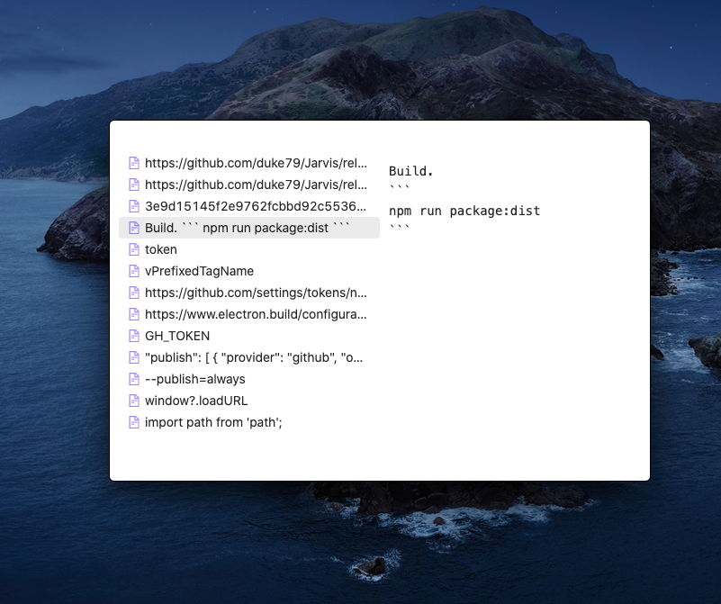

## Jarvis


Augments developer.



## Getting started
1. Install from the latest [release](https://github.com/duke79/Jarvis/releases).
2. Launch.
3. Keyboard shortcuts -
   1. `Ctrl+Shift+Space` to show
   2. `Esc` to hide.
   3. `Enter` to pick a history item

## Geek corner

### Run
```
npm run dev
```

### Publish
1. Generate a GitHub [token](https://github.com/settings/tokens/new)
2. Set env
```
export GH_TOKEN=<generated_token>
```
3. Build and publish
```
npm run package:dist
```

Bootstrapped from [electron-typescript-react](https://github.com/diego3g/electron-typescript-react)
